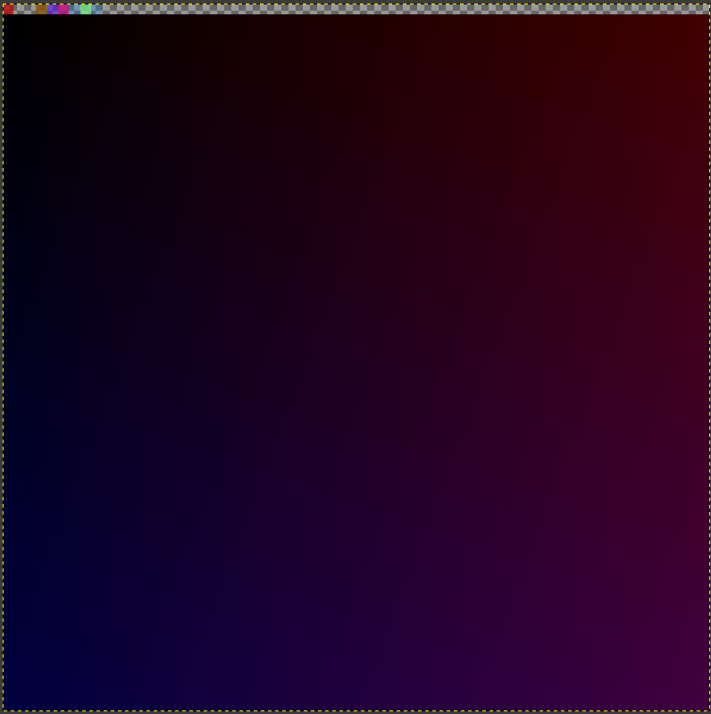

# README

My Computer Enhanced HW by Casey, find more here: <https://www.computerenhance.com/>
- Homework files can be found <https://github.com/cmuratori/computer_enhance/tree/main>

0. disassembler of x8086
    - in Python
    - works on mov, add, sub, cmp, jmp and labels
0. simulate x8086
    - base taken from [Casey's source](https://github.com/cmuratori/computer_enhance/releases/tag/Part1_0_SlowDecode)
    - in C++
    - Compile with:
```bash
clang++ sim86.cpp
```
    - Generate compile commands for clangd LSP:
```bash
bear -- clang++ sim86.cpp
```
    - Able to read and write from memory and to registers
    - Can produce a image :)



